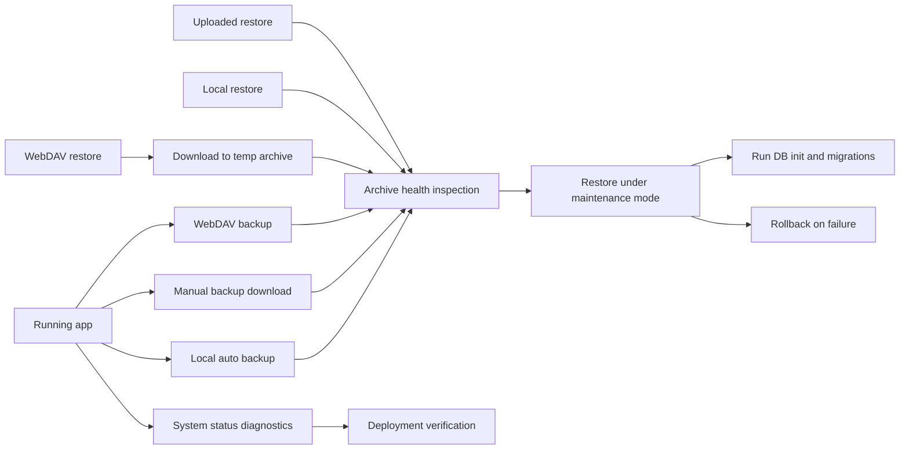

# Phase 1 Reliability Design

Date: 2026-06-17
Project: Procure Lite
Status: Design approved

## Purpose

Phase 1 makes Procure Lite safer to operate before broader UX, performance, and code-structure work. The goal is a reliability layer around the existing backup, restore, WebDAV, authentication, migration, and deployment paths.

The implementation should not rewrite the current backup system. The existing code already includes SQLite online backup, zip member validation, restore rollback, WebDAV upload/download, login lockout, secure cookies, maintenance mode, and smoke checks. Phase 1 should close the remaining operational gaps: prove backups are restorable, reject bad archives before restore, expose actionable health diagnostics, and make deployment updates easier to verify.

## Goals

- Treat a backup as successful only when the archive is created and passes health inspection.
- Ensure every restore entry point performs the same archive validation before replacing live data.
- Add system diagnostics that explain storage, database, backup, and WebDAV health without leaking secrets.
- Add deployment verification that checks the running container and public app state after an update.
- Expand tests around failure paths, not only happy paths.

## Non-Goals

- No mobile/PWA redesign in this phase.
- No ledger performance tuning in this phase.
- No large frontend component split in this phase.
- No replacement of SQLite, FastAPI, Docker Compose, or WebDAV provider logic.
- No new external monitoring service requirement.

## Current State

Relevant modules:

- `backup_service.py` builds backup archives, validates zip members, checks SQLite integrity, estimates source size, and restores with rollback snapshots.
- `auto_backup_service.py` schedules local backups and records last run, last success, last error, filename, and size.
- `webdav_service.py` normalizes WebDAV config, uploads backups, lists remote backups, prunes old backups, and downloads remote archives with size limits.
- `routers/system.py` exposes backup, health check, restore, local backup, WebDAV, auto-backup, and system status endpoints.
- `main.py` runs Alembic migrations at startup, initializes auth secrets, starts the auto-backup loop, guards authenticated API routes, and enables maintenance mode during restore.
- `scripts/validate_project.py` and `scripts/run_api_smoke_checks.py` already provide local validation and API smoke coverage.

Important existing protections:

- SQLite online backup avoids copying a live WAL database directly.
- Restore rejects unsafe zip entries, symlinks, special files, oversized archives, and corrupt SQLite databases.
- Restore snapshots the current database and uploads directory, then rolls back on failure.
- Restore releases pooled SQLite handles before replacing the database file.
- WebDAV authentication errors are mapped away from app-auth `401` responses.
- Auth uses Argon2, short-lived signed cookies, recovery codes, login lockout, and audit records.

## Proposed Approach

Use an incremental hardening approach: extend existing services and endpoints with shared validation and diagnostics. Avoid new architectural layers unless they remove duplicated restore checks or make status reporting clearer.

Rejected alternatives:

- A full backup subsystem rewrite would add risk without improving the highest-value gaps.
- A monitoring dashboard first would surface status but would not make backup and restore safer by itself.
- A deployment-only phase would improve updates but leave data protection weaker.

Recommended approach:

- Add small shared helpers around existing backup inspection.
- Thread health metadata through automatic backup and manual backup flows.
- Gate every restore path on the same inspection function.
- Expand `/api/system/status` with failure-tolerant diagnostics.
- Add a focused deployment verification script.

## Architecture



## Component Design

### Backup Health Metadata

Extend auto-backup status with health fields:

- `last_health_ok`: boolean
- `last_health_error`: string
- `last_checked_at`: Beijing ISO timestamp
- `last_checked_filename`: backup filename
- `last_checked_item_count`: integer when available
- `last_checked_upload_files`: integer when available

When `run_auto_backup()` creates a local archive, it should immediately call `inspect_backup_archive(destination)`. If archive creation succeeds but health inspection fails, the run should report `ok: false`, remove the failed archive if possible, and persist a clear `last_error` plus health failure fields.

For manual backup download, no persistent status is required because the archive is streamed as a response, but the route should inspect the temporary archive before returning it. The existing `/api/backup/health` endpoint remains the explicit verification tool for user-supplied archives.

### Restore Gate

Introduce a shared helper in the restore path, conceptually:

```python
def assert_backup_archive_healthy(archive_path: Path) -> dict:
    return inspect_backup_archive(archive_path)
```

Use this helper before `restore_from_archive()` in all restore entry points:

- uploaded restore: `/api/restore`
- local backup restore: `/api/local-backups/restore`
- WebDAV restore: `/api/webdav/restore`, after download completes

`restore_from_archive()` already validates internally. The preflight gate is intentionally redundant because it gives the API a clear, early failure point and can return the inspection report in successful restore responses.

### System Diagnostics

Extend `_build_system_status()` with a `health` object:

- `state_dir_writable`: true/false
- `database_check`: `{ ok, method, error }`, using a lightweight read-only SQLite check
- `storage_risk`: `ok`, `warning`, `critical`, or `unknown`
- `backup_health`: latest auto-backup health fields
- `webdav_config`: existing public config plus `password_decryptable`
- `runtime`: version and maintenance mode

Diagnostics must be best-effort. A broken database, missing file, unreadable disk usage, or invalid WebDAV password must not make `/api/system/status` fail. The endpoint should return a structured warning instead.

Storage risk rules:

- `unknown` when disk usage cannot be read.
- `critical` when free space is below estimated backup source size plus the existing backup margin.
- `warning` when free space is below two times estimated backup source size plus the margin.
- `ok` otherwise.

### WebDAV Reliability

Keep the current WebDAV config, listing, download, and retention behavior. Change WebDAV backup creation from direct streaming to a verified temporary-file flow:

- Build a local temporary archive with `build_backup_archive_file`.
- Inspect the temporary archive before upload.
- Upload the verified file with the existing file-upload path.
- Delete the temporary archive in a `finally` block.
- WebDAV restore must download into a temporary file, inspect it, then restore.
- WebDAV backup should return retention errors separately from upload success, as it already does, and include the archive health result.
- WebDAV config loading should distinguish "not configured" from "configured but password cannot decrypt" in system status, without returning the password.

### Deployment Verification

Add `scripts/verify_vps_deployment.sh` for VPS operations. Keep `start.sh` as the simple launcher and put post-update verification in the new script. It should check:

- Docker Compose is available.
- `.env` exists or is created from `.env.example`.
- The service starts.
- Docker healthcheck becomes healthy within a bounded wait.
- `/api/app/metadata` returns the expected version.
- `/api/system/status` returns JSON.
- If status reports `storage_risk: critical`, the script exits non-zero after printing the reason.

The script should not perform destructive rollback automatically. It should print the previous commands and next-step guidance so the operator can decide.

## Data Flow

Backup flow:

1. Acquire the existing data mutation lock where the route already does so.
2. Build the archive using the existing SQLite online backup and upload-file iteration.
3. Inspect the archive with `inspect_backup_archive`.
4. Persist health metadata for automatic local backups.
5. Return backup metadata and health result.

Restore flow:

1. Save or resolve the requested archive into a local path.
2. Inspect the archive before maintenance mode replaces data.
3. Enter maintenance mode and release database handles.
4. Call the existing restore function.
5. Run database initialization and migrations.
6. Clear maintenance mode.
7. Return restored upload count and the preflight health report.

System status flow:

1. Gather existing path, database, upload, storage, auto-backup, and WebDAV information.
2. Run bounded, best-effort health checks.
3. Return structured diagnostics even when individual checks fail.

## Error Handling

- Archive inspection failures return HTTP 400 for invalid user-selected archives.
- Local disk full during backup returns HTTP 507 when detected.
- WebDAV remote failures preserve provider status codes, except remote auth failure remains mapped to HTTP 400 to avoid confusing it with app login.
- System status never leaks WebDAV password or auth cookie secrets.
- Restore must continue to rollback on any failure after data replacement begins.
- Maintenance mode must be cleared in `finally` blocks.

## Testing Plan

Add focused tests:

- Auto-backup records successful health metadata after a valid backup.
- Auto-backup records health failure and removes the archive when inspection fails.
- Uploaded restore rejects a corrupt archive before restore runs.
- Local restore rejects a corrupt archive before restore runs.
- WebDAV restore rejects a downloaded corrupt archive before restore runs.
- System status returns structured diagnostics when database integrity check fails.
- System status returns structured diagnostics when WebDAV password cannot decrypt.
- System status returns `storage_risk: critical` when free space is below required backup margin.
- Deployment verification script behavior is covered where practical with isolated command helpers.

Existing smoke checks should continue to run through auth setup, item creation, attachment upload, backup download, backup health check, and reports.

## Rollout Plan

1. Implement shared restore preflight helper and route wiring.
2. Add auto-backup health metadata.
3. Extend system status diagnostics.
4. Add `scripts/verify_vps_deployment.sh`.
5. Add tests for the new failure paths.
6. Run syntax validation, API smoke checks, and targeted tests.
7. Commit implementation separately from this design spec.

## Acceptance Criteria

- A newly created local auto-backup records a passing health result.
- A corrupt archive is rejected before restore changes live data for upload, local, and WebDAV restore paths.
- `/api/system/status` returns actionable health diagnostics without exposing secrets.
- Low disk space can be surfaced as a critical storage risk.
- Deployment verification can confirm a running updated service and detect critical health failures.
- Existing API smoke checks still pass.

## Phase Boundary

- Deployment verification will be implemented as a separate shell script under `scripts/`.
- UI exposure of the expanded health object waits for Phase 2. Phase 1 only changes backend diagnostics and scripts.
